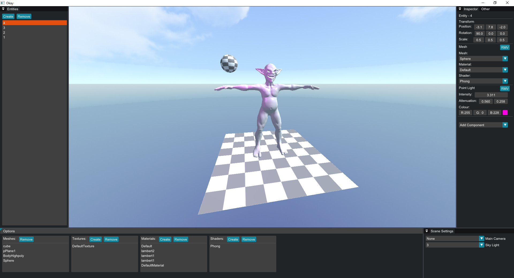

# Okay
Okay is a mini game engine running on DirectX 11. The project is WIP and is used a lot to test new techniques, play around with rendering, architecture and more. 
OkayEngine is the core and build into a static lib. Sub-projects (OkayEditor & OkayTerrain) run using OkayEngine and build their own features.
OkayTerrain is a procedural terrain generation test using Perlin noise. Since it is a test, it may not always build due to structure changes in OkayEngine.

# Details
* ECS (EnTT)
* Importing assets in real time
* SkyBox, including a sun
* Lightning
* Phong shading
* Real time editable materials and shaders 
  * Editable shaders work but are still WIP
* Perlin noise

# Planned features
* Bloom
* Instanced Rendering
* Shadow mapping
* Scene saving and loading
* Scripting (C# or LUA)

# Screenshots

