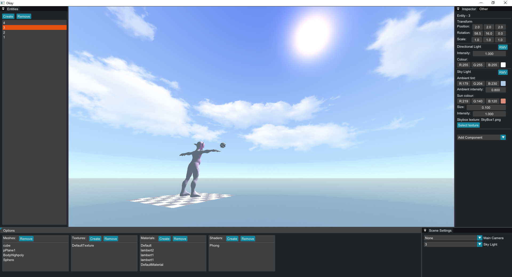

# Okay
Okay is a mini game engine running on DirectX 11 and the whole project is very subject to change and doesn't have a final goal.
I mostly use it to test implementations and play around with renderering, architecture and more. 
OkayEngine is the core which builds to a static lib. OkayEditor and OkayTerrain simply run on it and builds their own featues.
OkayTerrain was a procedural terrain generation test using Perlin noise and is quite messy. One day it might be cleaned up and moved into OkayEditor 👀

# Details:
* ECS (EnTT)
* Importing assets in real time (Assimp)
* SkyBox (The sun comes from the shader)
* Lights (Point and directonal)
* Phong shading
* Real time editable materials and shaders 
  * Editable shaders work but are still WIP
* Perlin noise (Currently only used in OkayTerrain)

# Planned features:
* Bloom
* Instancing
* Scripting (C# or LUA)

This is how it currently looks:

